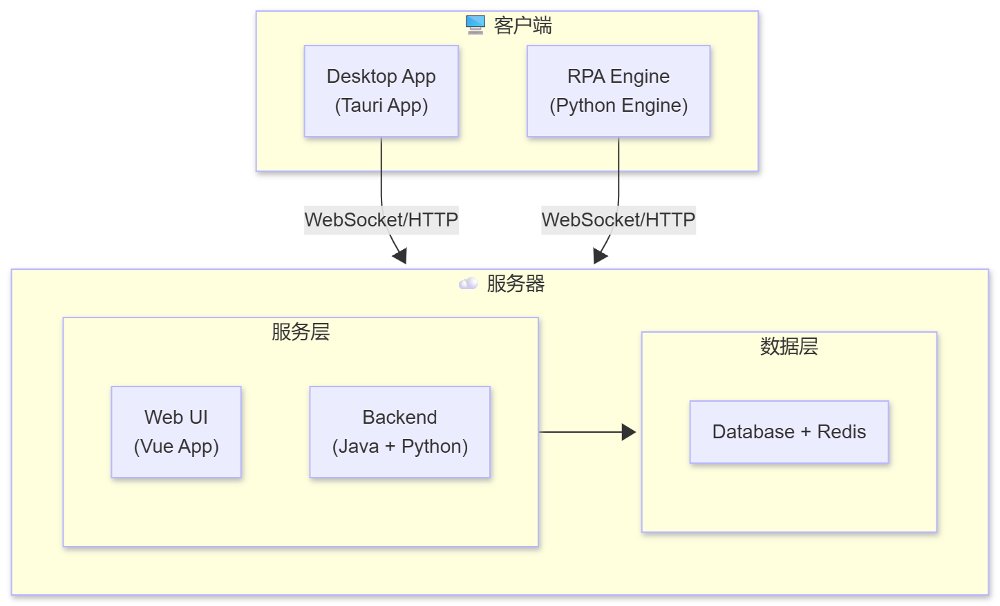

<div align="center">

# 🚀 Shoprpa Quick Start Guide

[](https://www.python.org/)
[](https://nodejs.org/)
[](https://www.docker.com/)

**Fast, Simple, Powerful RPA Automation Platform Deployment Guide**

[Quick Start](#️-environment-setup) · [Server Deployment](#-server-deployment-docker) · [Client Deployment](#-client-deployment-local) · [FAQ](#-faq)

</div>

---

## 📋 Table of Contents

- [System Requirements](#-system-requirements)
- [Environment Setup](#️-environment-setup)
- [Deployment Architecture](#️-deployment-architecture)
- [Server Deployment (Docker)](#-server-deployment-docker)
- [Client Deployment (Local)](#-client-deployment-local)
- [Development Environment](#-development-environment)
- [FAQ](#-faq)

## 💻 System Requirements

### Operating System
| OS | Version | Support Status |
|---------|---------|---------|
| Windows | 10/11 | ✅ Primary Support |

### Hardware Configuration
| Component | Minimum | Recommended |
|-------|---------|---------|
| **CPU** | 2 cores | 4 cores+ |
| **Memory** | 4GB | 8GB+ |
| **Disk** | 10GB available | 20GB+ |
| **Network** | Stable internet connection | - |

### Environment Dependencies
| Tool | Version | Description |
|-----|---------|------|
| **Node.js** | >= 22 | JavaScript runtime |
| **Python** | 3.13.x | RPA engine core |
| **Java** | JDK 8+ | Backend service runtime |
| **pnpm** | >= 9 | Node.js package manager |
| **UV** | 0.8+ | Python package manager |
| **7-Zip** | - | Create deployment archives |
| **SWIG** | - | Connect Python with C/C++ |

## 🛠️ Environment Setup

### 1️⃣ Python (3.13.x)

> 🐍 **Core Dependency** · Shoprpa requires Python 3.13.x as the RPA engine core

<details>
<summary>📦 <b>Installation Methods (Click to expand)</b></summary>

#### Method 1: Official Download (Recommended)
```bash
# Visit https://www.python.org/downloads/
# Download and install Python 3.13.x
```

#### Method 2: Using Winget
```bash
winget install Python.Python.3.13
```

#### Method 3: Using Chocolatey
```bash
choco install python --version=3.13.x
```

</details>

#### 📍 Python Installation Path

After installation, remember your Python installation path for later configuration:

| Installation Method | Typical Path |
|---------|---------|
| 🟢 Official Installer | `C:\Users\{username}\AppData\Local\Programs\Python\Python313\` |
| 🔵 Chocolatey | `C:\Python313\` or `C:\tools\python3\` |

**💡 Important Note:**
- ✓ Python executable: `{installation_directory}\python.exe`
- ✓ Example: `C:\Users\{username}\AppData\Local\Programs\Python\Python313\python.exe`

### 2️⃣ UV (0.8+)

> ⚡ **Fast Package Management** · Next-generation Python package manager, 10-100x faster than pip

<details>
<summary>📦 <b>Installation Methods (Click to expand)</b></summary>

```powershell
# Method 1: Official installation script (Recommended)
powershell -c "irm https://astral.sh/uv/install.ps1 | iex"

# Method 2: Using pip
pip install uv

# Method 3: Using Chocolatey
choco install uv
```

</details>

#### ✅ Verify Installation
```bash
uv --version
# ✓ Should display something like: uv 0.8.x (xxxxx)
```

**📖 Learn More**: [UV Official Documentation](https://docs.astral.sh/uv/)

### 3️⃣ pnpm (9+)

> 📦 **Efficient Package Management** · Disk space-saving Node.js package manager

<details>
<summary>📦 <b>Installation Methods (Click to expand)</b></summary>

```bash
# Method 1: Using npm (Recommended)
npm install -g pnpm@latest

# Method 2: Windows PowerShell
iwr https://get.pnpm.io/install.ps1 -useb | iex

# Method 3: macOS/Linux
curl -fsSL https://get.pnpm.io/install.sh | sh -

# Method 4: Homebrew (macOS)
brew install pnpm
```

</details>

#### ✅ Verify Installation
```bash
pnpm --version
# ✓ Should display 9.x.x or higher
```

**📖 Learn More**: [pnpm Official Documentation](https://pnpm.io/)

### 4️⃣ Docker

> 🐳 **Containerization Platform** · For rapid server deployment

<details>
<summary>📥 <b>Download & Install (Click to expand)</b></summary>

| Platform | Download Link |
|-----|---------|
| 🪟 Windows/Mac | [Docker Desktop](https://www.docker.com/products/docker-desktop/) |
| 🐧 Linux | [Docker Engine](https://docs.docker.com/engine/install/) |

</details>

#### ✅ Verify Installation
```bash
docker --version
docker compose --version
# ✓ Confirm both Docker and Docker Compose are installed correctly
```

---

### 5️⃣ 7-Zip

> 📦 **Compression Tool** · For creating deployment archive files

<details>
<summary>📥 <b>Download & Install (Click to expand)</b></summary>

**Official Website:** https://www.7-zip.org/

Download and install to system, or extract to a custom directory

</details>

#### ✅ Verify Installation
```bash
# If installed to system path
7z

# Or use full path
"C:\Program Files\7-Zip\7z.exe"
```

---

### 6️⃣ SWIG

> 🔗 **Interface Generator** · For connecting Python with C/C++ programs

<details>
<summary>📥 <b>Installation Steps (Click to expand)</b></summary>

#### Step 1: Download SWIG
Visit http://www.swig.org/download.html  
Download `swigwin-x.x.x.zip` and extract to any directory

#### Step 2: Add to System Environment Variables
Add the directory containing `swig.exe` to PATH environment variable  
For example: `C:\swig\swigwin-4.1.1`

#### Step 3: Verify Installation
```bash
swig -version
# ✓ Confirm SWIG is installed correctly
```

</details>

## 🏗️ Deployment Architecture

Shoprpa adopts a **Server-Client** architecture:



### Deployment Overview

1. **Server Deployment** - Quick deployment using Docker
   - Web management interface
   - Backend API services
   - Database and cache
   - AI services

2. **Client Deployment** - Deploy using packaging scripts
   - RPA execution engine
   - Desktop management application
   - Connect to server for task execution

## 🌐 Server Deployment (Docker)

> **Quick Deployment** · Launch all server components with Docker Compose in one command

The server provides web management interface, API services, database and other core services.

---

### 📦 Deployment Steps

#### Step 1️⃣: Clone Repository

```bash
git clone https://github.com/shoprpa/shoprpa.git
cd shoprpa
```

#### Step 2️⃣: Start Server

```bash
# Enter Docker directory
cd docker

# Copy .env file
cp .env.example .env

# Modify casdoor service configuration in .env
CASDOOR_EXTERNAL_ENDPOINT="http://{YOUR_SERVER_IP}:8000"

# 🚀 Start all services
docker compose up -d

# 📊 Check service status
docker compose ps
```

<details>
<summary>💡 <b>Expected Output Example</b></summary>

```
NAME                STATUS              PORTS
robot-service       Up 30 seconds       0.0.0.0:8080->8080/tcp
ai-service          Up 30 seconds       0.0.0.0:8001->8001/tcp
openapi-service     Up 30 seconds       0.0.0.0:8002->8002/tcp
mysql               Up 30 seconds       0.0.0.0:3306->3306/tcp
redis               Up 30 seconds       0.0.0.0:6379->6379/tcp
```

</details>

#### Step 3️⃣: Verify Server Deployment

```bash
# 📝 View service logs
docker compose logs -f
```

---

### 🔧 Server Management Commands

```bash
# 🛑 Stop services
docker compose down

# 🔄 Restart services
docker compose restart

# 📋 View specific service logs
docker compose logs -f robot-service

# ⬆️ Update images
docker compose pull
docker compose up -d
```

**📖 Detailed Configuration**: [Server Deployment Guide](./docker/QUICK_START.md)


## 💻 Client Deployment (Local)

> **Local Deployment** · Deploy engine and desktop application on machines running RPA tasks

The client includes RPA execution engine and desktop management application, needs to be deployed on machines executing RPA tasks.

---

### 🎯 One-Click Packaging Deployment

Suitable for production environments and end users.

#### 🪟 Windows Environment

<details>
<summary><b>Step 1️⃣: Prepare Python Environment</b></summary>

<br>

Ensure Python 3.13.x is installed to a local directory (e.g., `C:\Python313`).

**Environment Directory Structure:**
```
Python313/
├─ DLLs/
├─ Doc/
├─ include/
├─ Lib/
├─ libs/
├─ Scripts/
├─ tcl/
│
├─ NEWS.txt
├─ python.exe
├─ python3.dll
├─ python313.dll
├─ pythonw.exe
├─ vcruntime140.dll
└─ vcruntime140_1.dll
```

> **⚠️ Important Note:** Use a clean Python installation without additional third-party packages to reduce package size.

</details>

<details>
<summary><b>Step 2️⃣: Run Packaging Script</b></summary>

<br>

### Basic Usage

Execute the build script from the project root directory:

```bash
# 🚀 Full build (engine + frontend)
./build.bat --python-exe "C:\Program Files\Python313\python.exe"

# Or use default configuration (if Python is in default path)
./build.bat

# ⏳ Wait for operation to complete
# ✅ Build successful when console displays "Full Build Complete!"
```

**Execution Flow:**
1. ✅ Detect/copy Python environment to `build/python_core`
2. ✅ Install RPA engine dependencies
3. ✅ Compress Python core to `resources/python_core.7z`
4. ✅ Install frontend dependencies
5. ✅ Build desktop application

### Advanced Options

View all available parameters:

```bash
./build.bat --help
```

**Common Parameter Combinations:**

```bash
# 🔧 Specify Python path
./build.bat --python-exe "D:\Python313\python.exe"

# 🔧 Specify 7-Zip path
./build.bat --sevenz-exe "D:\7-Zip\7z.exe"

# ⏭️ Build engine only, skip frontend
./build.bat --skip-frontend

# ⏭️ Build frontend only, skip engine
./build.bat --skip-engine

# 🔀 Combine with short options
./build.bat -p "D:\Python313\python.exe" -s "D:\7-Zip\7z.exe"
```

**Parameter Description:**
| Parameter | Short | Description |
|-----------|-------|-------------|
| `--python-exe <path>` | `-p` | Specify Python executable path |
| `--sevenz-exe <path>` | `-s` | Specify 7-Zip executable path |
| `--skip-engine` | - | Skip engine (Python) build |
| `--skip-frontend` | - | Skip frontend build |
| `--help` | `-h` | Display help message |

### Manual Frontend Build

If you need to manually build the frontend separately, you can execute the following steps:

<details>
<summary>Click to expand manual build steps</summary>

```bash
cd frontend

# 📦 Install dependencies
pnpm install

# ⚙️ Configure environment variables
pnpm set-env

# 🖥️ Build desktop application
pnpm build:desktop
```

> **Tip:** Use `build.bat --skip-engine` to automatically complete the frontend build steps above.

</details>

</details>

<details>
<summary><b>Step 3️⃣: Install Exe Package</b></summary>

<br>

**Package completion path:**
```
/frontend/packages/electron-app/dist/
```

Double-click the Exe file to install.

</details>

<details>
<summary><b>Step 4️⃣: Configure Server Address</b></summary>

<br>

Modify the server address in `resources/conf.yaml` under the installation directory:

```yaml
# 32742 is the default port, modify if changed
remote_addr: http://YOUR_SERVER_ADDRESS:32742/
skip_engine_start: false
```

> **💡 Tip:** Replace `YOUR_SERVER_ADDRESS` with your actual server address

</details>

---

### 🌐 Development Server Addresses

| Service | Address | Description |
|-----|------|------|
| 🖥️ **Desktop App** | Auto-launch window | Desktop client |
| 🔌 **Backend Service API** | http://localhost:32742 | Backend Gateway Service Nginx |
| 🔑 **Casdoor Service API** | http://localhost:8000 | Authentication Service Casdoor |

---

## 🔍 Complete Deployment Verification

### ✅ Step 1: Server Check

```bash
# 📊 Check Docker service status
docker compose ps

# 🔍 Verify API response
# Open in browser: http://{YOUR_SERVER_IP}:32742/api/rpa-auth/user/login-check (32742 is default port, modify if changed)
# If returns {"code":"900001","data":null,"message":"unauthorized"} then deployment is correct and connected
```

### ✅ Step 2: Casdoor Service Check

```bash
# 🔍 Verify Casdoor service
# Open http://localhost:8000 in browser
# Casdoor authentication page should appear
```

**Follow-up Verification:**
- ✓ Check client node status in web interface
- ✓ Create simple test task to verify execution

## ❓ FAQ

### 🌐 Server Related

<details>
<summary><b>Q: Docker service fails to start?</b></summary>

<br>

```bash
# 🔍 Check port usage
netstat -tulpn | grep :8080

# ✅ Check Docker status
docker --version
docker compose --version

# 📋 View detailed error logs
docker compose logs
```

**Common Causes:**
- ❌ Ports occupied (8080, 3306, 6379)
- ❌ Docker service not started
- ❌ Insufficient resources (memory/disk space)

</details>

<details>
<summary><b>Q: Database connection failed?</b></summary>

<br>

```bash
# 📊 Check MySQL container status
docker compose ps mysql

# 📝 View MySQL logs
docker compose logs mysql

# 🔄 Restart database service
docker compose restart mysql
```

</details>

---

### 💻 Client Related

<details>
<summary><b>Q: Python environment copy failed?</b></summary>

<br>

```bash
# 🔍 Check Python installation path
where python  # Windows
which python  # Linux/macOS

# 🔍 Make sure to pass the Python executable file

✖️ ./build.bat -p "C:\\Python313"
✔️ ./build.bat -p "C:\\Python313\\python.exe"
```

**Solutions:**
- ✓ Ensure Python directory exists and is readable
- ✓ Run script with administrator privileges
- ✓ Check sufficient disk space

</details>

<details>
<summary><b>Q: Packaging script execution failed?</b></summary>

<br>

```bash
# ✅ Check all dependencies in preparation phase are fully installed

# 💾 Check disk space
dir  # Windows check available space
```

</details>

---

### 🔌 Connection Related

<details>
<summary><b>Q: Client cannot connect to server?</b></summary>

<br>

```bash
# 🌐 Check network connectivity
# Open the following URL in your browser to see if there's a response
# http://localhost:32742 can be replaced with your deployed server address+port
http://localhost:32742/api/rpa-auth/user/login-check

# 🛡️ Check firewall settings
# Windows: Control Panel > System and Security > Windows Defender Firewall
# Linux: ufw status

# ✅ Check server health status
curl http://localhost:32742/health
```

**Common Causes:**
- ❌ Server not started
- ❌ Firewall blocking
- ❌ Network unreachable
- ❌ Incorrect address in config file

</details>

<details>
<summary><b>Q: WebSocket connection failed?</b></summary>

<br>

```bash
# 🔌 Check WebSocket endpoint
curl -i -N -H "Connection: Upgrade" -H "Upgrade: websocket" \
     http://localhost:8080/ws

# 🔍 Check proxy settings
echo $http_proxy
echo $https_proxy
```

**Solutions:**
- ✓ Confirm server WebSocket service is running
- ✓ Check if proxy affects connection
- ✓ Verify firewall rules

</details>

---

### 🏗️ Build Related

<details>
<summary><b>Q: Frontend build failed?</b></summary>

<br>

```bash
# 🧹 Clear cache
pnpm store prune
rm -rf node_modules pnpm-lock.yaml

# 📦 Reinstall
pnpm install

# ✅ Check Node.js version
node --version  # Requires 22+
```

**Common Causes:**
- ❌ Node.js version not meeting requirements
- ❌ Dependency version conflicts
- ❌ Cache corruption

</details>

<details>
<summary><b>Q: pywinhook installation fails with swig.exe not found error?</b></summary>

<br>

**Error Message:**
```
error: Microsoft Visual C++ 14.0 is required
or
swig.exe not found
```

**Solution Steps:**

1️⃣ **Download SWIG**
   - Visit http://www.swig.org/download.html
   - Download `swigwin-x.x.x.zip` and extract to any directory

2️⃣ **Add to System Environment Variables**
   - Add the directory containing `swig.exe` to PATH environment variable
   - For example: `C:\swig\swigwin-4.1.1`

3️⃣ **Verify Installation**
   ```bash
   swig -version
   ```

4️⃣ **Reinstall pywinhook**
   ```bash
   pip install pywinhook
   ```

</details>

## 📞 Get Help

<div align="center">

**Having issues? We're here to help!**

</div>

| Channel | Link | Description |
|-----|------|------|
| 📧 **Technical Support** | [support@shoprpa.com](mailto:support@shoprpa.com) | Contact technical team directly |
| 💬 **Community Discussion** | [GitHub Discussions](https://github.com/shoprpa/shoprpa/discussions) | Exchange ideas with community |
| 🐛 **Issue Report** | [GitHub Issues](https://github.com/shoprpa/shoprpa/issues) | Submit bugs and feature requests |
| 📖 **Full Documentation** | [Project Documentation](README.md) | View detailed usage documentation |

---

## 🎯 Next Steps

<div align="center">

**✨ Congratulations on completing deployment! Now start your RPA automation journey ✨**

</div>

<br>


| Step | Content | Link |
|-----|------|------|
| 1️⃣ | **📚 Learn to Use** | Read [User Guide](README.md) to learn how to create RPA processes |
| 2️⃣ | **🔧 Component Development** | Refer to [Component Development Guide](engine/components/) to develop custom components |
| 3️⃣ | **🤝 Contribute** | Check [Contributing Guide](CONTRIBUTING.md) to participate in project development |
| 4️⃣ | **📱 Production Deployment** | Refer to [Production Deployment Guide](docker/PRODUCTION.md) for production deployment |

---

<div align="center">

### 🎉 Deployment Complete!

**You have successfully deployed Shoprpa server and client**

Now you can start creating powerful RPA automation workflows!

<br>


**Happy Automating! 🤖✨**

</div>
